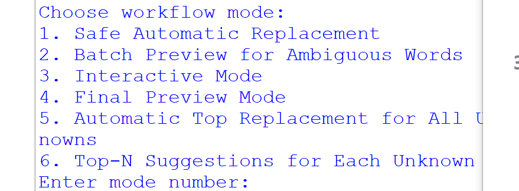

# 📝 Word List Cleaner & POS Categorizer


A Python toolkit to clean, correct, and categorize word lists. Automatically detects typos, applies corrections, and classifies words into nouns, verbs, adjectives, and adverbs using WordNet. Ambiguous words are intelligently handled, and your original data is always safe.

---

## 🎬 Demo



### Screenshots

**Workflow Menu**  
  

**Interactive Correction**  
  

**Categorized Outputs**  
  

**Replacement Log Preview**  


---

## ⚙️ Usage

1. Place your word list as `words.txt` (one word per line) in the project root.  
2. Run the script:

```bash
python wordlist_cleaner.py
